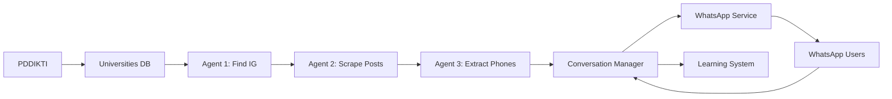

<div align="center">

  # 🎓 GetContactAI Agent

  ### AI-Powered WhatsApp Outreach System for Indonesian Universities

  
  
  
  

  [Features](#-features) • [Architecture](#-architecture) • [Quick Start](#-quick-start) • [Documentation](#-documentation)

  

  **Automated WhatsApp outreach with AI-driven conversations to collect university contact information ethically and efficiently.**

</div>

---

## 📖 Overview

**GetContactAI Agent** is an intelligent automation system designed to contact Indonesian universities via WhatsApp to collect secretariat contact information. The system combines web scraping, computer vision, conversational AI, and state management to conduct respectful, personalized outreach campaigns.

### 🎯 What It Does

1. **Discovers Universities** - Scrapes university data from [PDDIKTI](https://pddikti.kemdikbud.go.id/) (Indonesian higher education database)
2. **Finds Instagram Handles** - Searches for official university Instagram accounts
3. **Extracts Phone Numbers** - Uses GPT-4o Vision OCR to find contacts from Instagram posts
4. **Initiates Conversations** - Sends personalized WhatsApp messages using AI-generated content
5. **Manages Follow-ups** - Automated follow-up sequences based on conversation state
6. **Learns & Improves** - Captures insights to enhance future interactions

---

## ✨ Features

### 🤖 AI-Powered Pipeline
- **GPT-4o Vision** for phone number extraction from images
- **GPT-4o-mini** for intelligent conversation management
- **Dynamic message generation** based on university context
- **Smart reply analysis** to determine next actions

### 💬 Human-Like WhatsApp Behavior
- **Typing indicators** for natural conversation feel
- **Configurable delays** between messages
- **Read receipts** for message confirmation
- **Multi-message handling** with proper threading

### 📊 Real-Time Dashboard
- **Live monitoring** of all active conversations
- **Pipeline status** tracking with visual indicators
- **WebSocket updates** for instant data refresh
- **Export capabilities** (CSV/Excel) for collected data

### ⚙️ Advanced Configuration
- **Respectful outreach hours** (configurable WIB timezone)
- **Daily quota limits** to prevent spam
- **Per-university enable/disable** controls
- **Test mode** for development without real outreach

### 🎓 Audiensi Feature (Zoom Scheduling)
- **Automated Zoom meeting** scheduling with university rectors
- **PDF invitation** generation
- **Template management** for personalized invitations
- **Conversation tracking** through scheduling funnel

### 📚 Learning System
- **Conversation analysis** for continuous improvement
- **Lesson capture** from successful interactions
- **Pattern recognition** for better responses

---

## 🏗️ Architecture

```
┌─────────────────────────────────────────────────────────────────┐
│                         Frontend (React)                         │
│                    localhost:5173                                │
│  ┌──────────────┐  ┌──────────────┐  ┌──────────────┐         │
│  │  Dashboard   │  │  Pipeline    │  │ Conversations │         │
│  └──────────────┘  └──────────────┘  └──────────────┘         │
└──────────────────────────────┬──────────────────────────────────┘
                               │ WebSocket + HTTP
┌──────────────────────────────┴──────────────────────────────────┐
│                      Orchestrator (FastAPI)                      │
│                       localhost:8000                             │
│  ┌─────────────┐  ┌─────────────┐  ┌─────────────┐            │
│  │   Agents    │  │ Scheduler   │  │  State      │            │
│  │             │  │             │  │  Machine    │            │
│  │ • IG Handle │  │ • APScheduler│  │ • WhatsApp  │            │
│  │ • Post      │  │ • Cron Jobs │  │ • Audiensi  │            │
│  │   Scraper   │  │ • Quota Mgmt│  │             │            │
│  │ • Phone     │  │             │  │             │            │
│  │   Extractor │  │             │  │             │            │
│  └─────────────┘  └─────────────┘  └─────────────┘            │
└──────────────────────────────┬──────────────────────────────────┘
                               │ HTTP/Webhook
┌──────────────────────────────┴──────────────────────────────────┐
│                   WhatsApp Service (Node.js)                     │
│                       localhost:3100                             │
│  ┌─────────────────────────────────────────────────────────┐   │
│  │           Baileys WhatsApp Library                        │   │
│  │  • QR Code Authentication • Message Queue                │   │
│  │  • Typing Indicators • Read Receipts                     │   │
│  └─────────────────────────────────────────────────────────┘   │
└──────────────────────────────┬──────────────────────────────────┘
                               │
                               ▼
                        📱 WhatsApp Servers
```

### Data Flow



---

## 🛠️ Tech Stack

### Backend (Orchestrator)
| Component | Technology |
|-----------|------------|
| **Framework** | FastAPI |
| **Database** | SQLite (aiosqlite) |
| **Scheduler** | APScheduler |
| **AI/ML** | OpenAI GPT-4o, GPT-4o-mini |
| **HTTP Client** | httpx |
| **Web Scraping** | Serper.dev, Apify |

### WhatsApp Service
| Component | Technology |
|-----------|------------|
| **Runtime** | Node.js 20+ |
| **Framework** | Express.js |
| **WhatsApp** | @whiskeysockets/baileys |
| **Database** | SQLite (better-sqlite3) |

### Frontend
| Component | Technology |
|-----------|------------|
| **Framework** | React 18 + Vite |
| **Routing** | React Router 6 |
| **State** | TanStack React Query 5 |
| **Styling** | Tailwind CSS 3 |
| **Icons** | Lucide React |
| **Real-time** | WebSocket |

---

## 📋 Prerequisites

Before installing, ensure you have:

- **Python 3.11+** - [Download](https://www.python.org/downloads/)
- **Node.js 20+** - [Download](https://nodejs.org/)
- **Git** - [Download](https://git-scm.com/downloads)

### Required API Keys

| Service | Purpose | Get It |
|---------|---------|--------|
| **OpenAI API** | GPT-4o Vision & Chat | [openai.com](https://openai.com/) |
| **Serper.dev** | Google Search results | [serper.dev](https://serper.dev/) |

### Optional API Keys

| Service | Purpose |
|---------|---------|
| **Instagram Credentials** | Direct IG scraping |
| **Apify API Key** | Instagram data extraction |

---

## 🚀 Quick Start

### 1. Clone the Repository

```bash
git clone https://github.com/your-username/GetContactAI.git
cd GetContactAI
```

### 2. Install Dependencies

```bash
# Orchestrator (Python)
pip install -r orchestrator/requirements.txt

# WhatsApp Service (Node.js)
cd whatsapp-service && npm install && cd ..

# Frontend (Node.js)
cd frontend && npm install && cd ..
```

### 3. Configure Environment

```bash
# Copy environment template
cp .env.example .env

# Edit .env with your API keys
# Required: OPENAI_API_KEY, SERPER_API_KEY
```

### 4. Initialize Database

```bash
python scripts/setup_db.py
```

### 5. Start Services

**Important: Start services in this order:**

```bash
# Terminal 1: WhatsApp Service (must start first)
cd whatsapp-service && npm run dev

# Terminal 2: Orchestrator
python -m uvicorn orchestrator.main:app --port 8000 --reload

# Terminal 3: Frontend
cd frontend && npm run dev
```

### 6. Access the Application

- **Frontend Dashboard**: http://localhost:5173
- **API Documentation**: http://localhost:8000/docs
- **Health Check**: http://localhost:8000/health

---

## ⚙️ Configuration

### Environment Variables

```bash
# Core Configuration
OPENAI_API_KEY=sk-...                    # Required
SERPER_API_KEY=...                       # Required

# Database
DATABASE_PATH=data/getcontact.db         # SQLite database path

# WhatsApp Service
WA_SERVICE_URL=http://localhost:3100     # WhatsApp service URL
WEBHOOK_URL=http://localhost:8000/webhook/incoming

# Outreach Settings
OUTREACH_START_HOUR=7                    # WIB timezone
OUTREACH_END_HOUR=22
MAX_DAILY_CONVERSATIONS=50
MIN_MESSAGE_GAP_SECONDS=30

# AI Settings
AGENT_MODEL=gpt-4o-mini                  # Chat model
VISION_MODEL=gpt-4o                      # Vision OCR model

# Optional Services
IG_USERNAME=...                          # Instagram credentials
IG_PASSWORD=...
APIFY_API_KEY=...
```

### Configuration via Dashboard

Many settings can be adjusted dynamically through the **Settings** page:
- Toggle chatbots on/off
- Adjust outreach hours
- Modify daily quotas
- Enable/disable features

---

## 📖 Usage Guide

### 1. Collect Universities

Navigate to **Dashboard** → Click **"Collect Universities"**

Select province and limit, then click start. The system will fetch university data from PDDIKTI.

### 2. Run Pipeline Agents

Go to **Pipeline** page and run agents in sequence:

1. **Find IG Handles** - Search Instagram accounts for universities
2. **Scrape IG Posts** - Download recent posts from found accounts
3. **Extract Phones** - Use GPT-4o Vision to find phone numbers in posts

### 3. Start Outreach

Navigate to **Control Panel**:
- Ensure system is not paused
- Enable contact finder chatbot
- Click "Start Outreach" or wait for scheduled runs

### 4. Monitor Conversations

Visit **Conversations** page to:
- View all active conversations
- Read message history
- Track conversation states
- Manually trigger test conversations

### 5. Export Data

Go to **Universities** page → Click **Export** to download collected data as CSV or Excel.

---

## 🔌 API Documentation

### Core Endpoints

#### Health Check
```http
GET /health
```

#### Dashboard Statistics
```http
GET /dashboard
```

#### Pipeline Status
```http
GET /pipeline/status
```

#### Trigger Agent
```http
POST /pipeline/find-ig-handles
POST /pipeline/scrape-ig-posts
POST /pipeline/extract-phones
```

#### Control System
```http
POST /control/pause
POST /control/resume
GET /control/status
```

### Full API Docs

Interactive API documentation available at:
- **Swagger UI**: http://localhost:8000/docs
- **ReDoc**: http://localhost:8000/redoc

---

## 🗂️ Project Structure

```
GetContactAI/
├── orchestrator/              # Python FastAPI backend
│   ├── agents/               # Pipeline agents
│   ├── audiensi/             # Zoom scheduling feature
│   ├── agent/                # Agentic AI system
│   ├── main.py               # FastAPI application
│   ├── config.py             # Configuration
│   ├── db.py                 # Database layer
│   ├── scheduler.py          # Job scheduler
│   ├── conversation.py       # Conversation state machine
│   └── message_queue.py      # WhatsApp message queue
│
├── whatsapp-service/         # Node.js WhatsApp bridge
│   ├── src/
│   │   ├── baileys.ts        # WhatsApp client wrapper
│   │   ├── queue.ts          # Message queue
│   │   └── server.ts         # Express server
│   └── package.json
│
├── frontend/                 # React frontend
│   ├── src/
│   │   ├── components/       # React components
│   │   ├── pages/            # Page components
│   │   ├── hooks/            # Custom hooks
│   │   ├── lib/              # Utilities
│   │   └── App.tsx
│   └── package.json
│
├── scripts/                  # Utility scripts
│   ├── setup_db.py           # Database initialization
│   └── collect_universities.py
│
├── data/                     # SQLite database (created at runtime)
├── .env.example              # Environment template
├── docker-compose.yml        # Docker orchestration
└── README.md                 # This file
```

---

## 🐳 Docker Deployment

### Using Docker Compose

```bash
# Build and start all services
docker-compose up -d

# View logs
docker-compose logs -f

# Stop services
docker-compose down
```

### Individual Services

```bash
# Orchestrator
cd orchestrator && docker build -t getcontact-orchestrator .
docker run -p 8000:8000 --env-file .env getcontact-orchestrator

# WhatsApp Service
cd whatsapp-service && docker build -t getcontact-whatsapp .
docker run -p 3100:3100 getcontact-whatsapp

# Frontend
cd frontend && docker build -t getcontact-frontend .
docker run -p 5173:5173 getcontact-frontend
```

---

## 🧪 Testing

### Test Mode

Enable test conversations without affecting real universities:

```bash
# Via API
POST /conversations/test
{
  "phone": "6281234567890",
  "universityName": "Test University"
}
```

### Running Tests

```bash
# Python tests (orchestrator)
pytest orchestrator/tests/

# Node.js tests (whatsapp-service)
npm test --prefix whatsapp-service

# Frontend tests
npm test --prefix frontend
```

---

## 📊 Conversation States

```
PENDING
    ↓
INITIAL_SENT
    ↓
WAITING_REPLY
    ↓
    ├─→ GOT_NUMBER        ✅ Success
    ├─→ REFUSED           ❌ Contact refused
    ├─→ NEED_MORE         🔄 Need follow-up
    ├─→ ABANDONED         ⏹️ Too many follow-ups
    └─→ UNDELIVERED       📵 Message not delivered
```

---

## 🤝 Contributing

Contributions are welcome! Please follow these steps:

1. Fork the repository
2. Create a feature branch (`git checkout -b feature/AmazingFeature`)
3. Commit your changes (`git commit -m 'Add some AmazingFeature'`)
4. Push to the branch (`git push origin feature/AmazingFeature`)
5. Open a Pull Request

### Development Guidelines

- Follow Python PEP 8 style guidelines
- Use TypeScript strict mode for Node.js
- Write meaningful commit messages
- Add tests for new features
- Update documentation as needed

---

## 📝 License

This project is licensed under the MIT License - see the [LICENSE](LICENSE) file for details.

---

## 🙏 Acknowledgments

- **OpenAI** for GPT-4o and GPT-4o-mini APIs
- **Baileys** for the excellent WhatsApp library
- **FastAPI** for the modern Python framework
- **PDDIKTI** for the Indonesian higher education database

---

## 📧 Support

For questions, issues, or suggestions:

- Open an issue on GitHub
- Contact: [your-email@example.com]

---

<div align="center">

  **Built with ❤️ for Indonesian Universities**

  [⬆ Back to Top](#-getcontactai-agent)

</div>
